# GitHub Stats Badge Generator

[](https://opensource.org/licenses/MIT)
[](https://github.com/jansitarski/github-stats-badge/releases)

> Generate beautiful, animated SVG badges with your GitHub statistics - including private repository data!

<p align="center">
  
</p>

## Features

- **Beautiful Design**: Modern, animated SVG with smooth entrance effects
- **Dark/Light Mode**: Automatically adapts to user's system preferences
- **Private Repo Support**: Include statistics from your private repositories
- **Minimal Dependencies**: Only requires [Jinja2](https://jinja.palletsprojects.com/) for SVG template rendering
- **6 Key Metrics**:
  - 📦 Public Repositories
  - 🔒 Private Repositories  
  - 🤝 Contributed Repositories
  - ✅ Merged Pull Requests
  - 📝 Total Commits
  - ➕ Lines Added
- **Automated Updates**: Runs on GitHub Actions schedule
- **Customizable**: Configure output path, markers, and more

## Quick Start

### 1. Set Up Your Repository

Add the stats markers to your `README.md` where you want the badge to appear:

```markdown
<!-- stats:start -->
<p align="center">
  
</p>
<!-- stats:end -->
```

### 2. Create Workflow File

Create `.github/workflows/update-stats.yml` in your repository:

```yaml
name: Update GitHub Stats Badge

on:
  schedule:
    - cron: '0 0 * * 1'  # Weekly on Monday at midnight UTC
  workflow_dispatch:

permissions:
  contents: write

jobs:
  update-stats:
    runs-on: ubuntu-latest
    
    steps:
      - name: Checkout repository
        uses: actions/checkout@v4
      
      - name: Generate stats badge
        uses: jansitarski/github-stats-badge@v1
        with:
          github_token: ${{ secrets.GITHUB_TOKEN }}
      
      - name: Commit updated stats
        uses: stefanzweifel/git-auto-commit-action@v5
        with:
          commit_message: 'chore: update GitHub stats badge'
          file_pattern: 'gh_stats.svg README.md'
```

### 3. Configure Token (For Private Repo Stats)

The default `GITHUB_TOKEN` works for public repos. For **private repository statistics**, you need to create a Personal Access Token (PAT):

1. Go to [GitHub Settings → Developer settings → Personal access tokens → Tokens (classic)](https://github.com/settings/tokens)
2. Click "Generate new token (classic)"
3. Give it a name like "GitHub Stats Badge"
4. Select scopes:
   - ✅ `repo` (Full control of private repositories)
   - ✅ `read:user` (Read user profile data)
5. Click "Generate token" and copy it
6. Go to your repository → Settings → Secrets and variables → Actions
7. Create a new secret named `STATS_TOKEN` and paste your token
8. Update the workflow to use your token:
   ```yaml
   github_token: ${{ secrets.STATS_TOKEN }}
   ```

### 4. Run the Workflow

- **Manual Run**: Go to Actions tab → Update GitHub Stats Badge → Run workflow
- **Automatic**: Runs on the schedule you configured

That's it! Your badge will be generated and automatically updated.

## Configuration

### Action Inputs

| Input | Description | Required | Default |
|-------|-------------|----------|---------|
| `github_token` | GitHub token with `repo` and `read:user` scopes | ✅ Yes | - |
| `username` | GitHub username to generate stats for | No | `${{ github.repository_owner }}` |
| `output_path` | Path where the SVG badge will be saved | No | `gh_stats.svg` |
| `readme_update` | Whether to automatically update README.md | No | `true` |
| `readme_path` | Path to the README file to update | No | `README.md` |
| `stats_start_marker` | HTML comment marker for stats injection start | No | `<!-- stats:start -->` |
| `stats_end_marker` | HTML comment marker for stats injection end | No | `<!-- stats:end -->` |

### Example: Custom Configuration

```yaml
- name: Generate stats badge
  uses: jansitarski/github-stats-badge@v1
  with:
    github_token: ${{ secrets.STATS_TOKEN }}
    username: octocat
    output_path: assets/github-stats.svg
    readme_update: 'true'
    readme_path: profile/README.md
    stats_start_marker: '<!-- BEGIN STATS -->'
    stats_end_marker: '<!-- END STATS -->'
```

## Schedule Configuration

Customize when the badge updates by modifying the cron expression:

```yaml
on:
  schedule:
    # Every day at midnight UTC
    - cron: '0 0 * * *'
    
    # Every Monday at 2:00 AM UTC
    # - cron: '0 2 * * 1'
    
    # Every 6 hours
    # - cron: '0 */6 * * *'
    
    # First day of every month
    # - cron: '0 0 1 * *'
```

[Cron expression generator](https://crontab.guru/) can help you create custom schedules.

## Usage Examples

### Basic Profile Badge

The simplest setup - just add markers and run the workflow:

```markdown
# Hi there, I'm @username

<!-- stats:start -->
<!-- stats:end -->
```

See [examples/basic/](./examples/basic/) for full example.

### Custom Output Location

Save the badge to a specific folder:

```yaml
- name: Generate stats badge
  uses: jansitarski/github-stats-badge@v1
  with:
    github_token: ${{ secrets.GITHUB_TOKEN }}
    output_path: assets/stats.svg
```

Then reference it in your README:
```markdown

```

See [examples/advanced/](./examples/advanced/) for full example.

### Manual Badge Placement

Disable automatic README updates and place the badge manually:

```yaml
- name: Generate stats badge
  uses: jansitarski/github-stats-badge@v1
  with:
    github_token: ${{ secrets.GITHUB_TOKEN }}
    readme_update: 'false'
```

Then add to your README:
```markdown
<div align="center">
  
</div>
```

### Self-Hosted / Local Usage

You can run the script locally or on self-hosted runners:

```bash
# Clone the repository
git clone https://github.com/jansitarski/github-stats-badge.git
cd github-stats-badge

# Install the package
pip install -e .

# Set environment variables
export GITHUB_USERNAME="your-username"
export GITHUB_TOKEN="your-personal-access-token"
export OUTPUT_PATH="gh_stats.svg"

# Run the script
python3 -m badge.main
```

See [examples/self-hosted/](./examples/self-hosted/) for full example.

## Requirements

- **Python**: 3.8 or higher (requires Jinja2 — installed automatically in GitHub Actions)
- **GitHub Token**: With `repo` and `read:user` scopes for private repo access
- **Permissions**: Workflow needs `contents: write` to commit badge back to repo

## How It Works

1. **Collects Metrics**: Uses GitHub's GraphQL and REST APIs to fetch:
   - Repository counts (public/private/contributed)
   - Pull request and commit statistics
   - Lines of code added across all merged PRs
   
2. **Generates SVG**: Creates a custom animated SVG with:
   - Responsive dark/light mode theming
   - Smooth entrance animations
   - Grid pattern background with noise filter
   - Timestamp showing last update
   
3. **Updates README**: Optionally injects the badge between your markers
   
4. **Commits Changes**: The workflow commits the updated badge and README

## Troubleshooting

### Badge Not Updating

- ✅ Check that workflow has `contents: write` permission
- ✅ Verify markers exist in README: `<!-- stats:start -->` and `<!-- stats:end -->`
- ✅ Check workflow runs in the Actions tab for errors
- ✅ Ensure token has `repo` and `read:user` scopes

### Private Repo Stats Showing 0

- ✅ You must use a Personal Access Token (PAT), not the default `GITHUB_TOKEN`
- ✅ PAT must have `repo` scope selected
- ✅ Pass the PAT as `github_token: ${{ secrets.YOUR_PAT_NAME }}`

### Rate Limiting

- GitHub API has rate limits (5,000 requests/hour for authenticated requests)
- The script makes approximately 10-20 API calls per run
- Recommended: Don't run more frequently than hourly

### Badge Not Showing in README

- ✅ Ensure the SVG path is correct (relative to README location)
- ✅ If README is in a subfolder, adjust `output_path` or image path
- ✅ Verify the SVG file was committed to the repository

## Contributing

Contributions are welcome! Please feel free to submit a Pull Request. For major changes, please open an issue first to discuss what you would like to change.

### Development Setup

```bash
git clone https://github.com/jansitarski/github-stats-badge.git
cd github-stats-badge

# Run locally for testing
pip install -e ".[dev]"
export GITHUB_USERNAME="testuser"
export GITHUB_TOKEN="your-token"
python3 -m badge.main
```

## License

This project is licensed under the MIT License - see the [LICENSE](LICENSE) file for details.

## Acknowledgments

- Inspired by various GitHub profile badge generators
- Built with Python and Jinja2
- Uses GitHub's GraphQL and REST APIs

## Support

If you find this project useful, please consider:
- ⭐ Starring the repository
- 🐛 Reporting issues
- 🔀 Contributing improvements
- 📢 Sharing with others

---

<p align="center">
  Made with ❤️ by <a href="https://github.com/jansitarski">Jan Sitarski</a>
</p>
